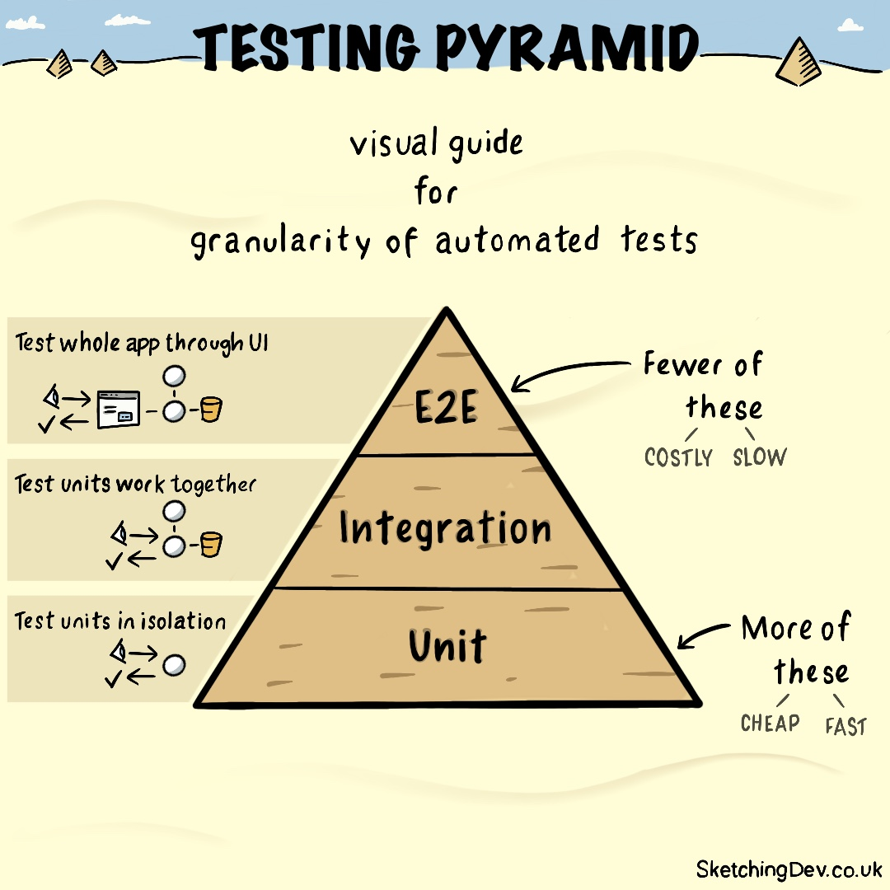

# Pyra




> Illustration by [SketchingDev](https://sketchingdev.co.uk).

Pyra looks at your tests and tells you two things: is the overall pyramid the right
shape, and — on a given pull request — did the code you just changed get tested at the
level it should be.

It doesn't boot your app. It reads files and a YAML config, so it runs the same on
Symfony, Laravel or a plain PHP project.

## Why

The test pyramid (Mike Cohn) says: lots of small, fast, isolated unit tests at the
bottom; fewer slow, costly end-to-end tests at the top. The
[Practical Test Pyramid](https://martinfowler.com/articles/practical-test-pyramid.html)
boils it down to two rules worth keeping:

> - Write tests with different granularity
> - The more high-level you get the fewer tests you should have

Most teams agree with this and then drift away from it one PR at a time — a feature
ships with an end-to-end test and no unit test, a "unit" test quietly spins up the
database. Pyra is there to notice.

## Install

```bash
composer require --dev ahmed-bhs/pyra
```

## The two commands

`pyra check` looks at the whole suite: how many tests live at each level, whether the
ratios and ordering still make a pyramid, and whether any "unit" test is really an
integration test in disguise (it depends on something like an `EntityManager`).

`pyra diff` looks at one pull request. For every class you changed, it checks the test
levels you said that area should have. To do that it searches the *whole* test suite, not
just the files in the diff — so a test you wrote three months ago still counts, and you
don't get nagged about a class that's already covered.

```bash
vendor/bin/pyra check --strict
vendor/bin/pyra diff --base origin/main --strict
vendor/bin/pyra diff --base origin/main --coverage build/clover.xml
```

With `--strict`, a violation exits `1` (for CI). Without it, violations are printed but
the command still exits `0`.

## Config

A `pyra.yaml` at the project root. Works the same whether you're on Symfony, Laravel or
plain PHP — only the paths and the framework-specific dependencies change.

### Symfony

```yaml
pyra:
    enforce_ordering: true

    levels:
        unit:
            paths: [tests/Unit]
            min_percentage: 60
            forbidden_dependencies:
                - Doctrine\ORM\EntityManagerInterface
                - Symfony\Bundle\FrameworkBundle\Test\KernelTestCase
                - Zenstruck\Foundry\Test\ResetDatabase
        integration:
            paths: [tests/Integration]
            max_percentage: 35
        e2e:
            paths: [features]
            counter: gherkin        # .feature scenarios instead of PHPUnit methods
            max_percentage: 15

    diff:
        base: origin/main
        sources:                    # which areas expect which test levels
            - path: src/Domain
              expect: [unit]
            - path: src/Application
              expect: [unit, integration]
        ignore:
            - migrations
            - config
```

### Laravel

```yaml
pyra:
    levels:
        unit:
            paths: [tests/Unit]
            forbidden_dependencies:
                - Illuminate\Foundation\Testing\RefreshDatabase
                - Illuminate\Foundation\Testing\DatabaseTransactions
        integration:
            paths: [tests/Feature]

    diff:
        base: origin/main
        sources:
            - path: app/Domain
              expect: [unit]
            - path: app/Http
              expect: [integration]
```

## What it actually catches

- A class you changed that has no test at the level its area expects.
- A unit test that pulls in an integration-only dependency.
- A pyramid that has tipped over (more integration than unit), compared within one
  counting style.
- If you pass `--coverage`, the changed lines that no test executes.

## Where it stops

A few things worth knowing before you trust the output:

- Without a coverage file it can only tell you a test *looks* missing, never that
  coverage is low. "Coverage" is only ever reported from a clover/cobertura XML you pass
  in with `--coverage`.
- There's no notion of a "feature" — the unit of work is the changed class, summed up
  over the PR.
- The class-to-test matching is by name. A test that mentions a class without really
  exercising it is a false positive; a class hit only through a collaborator (or
  reflection, or the container) without being named is a false negative. Coverage is how
  you close that gap.
- A `.feature` file names no PHP class, so e2e can't be name-matched — only the path
  rules or coverage reach it.
- Telling coverage apart *per level* needs one coverage run per suite; a single merged
  file can't say which level hit a line.
- It counts PHPUnit (`test*` / `#[Test]`) and Gherkin scenarios. Pest isn't counted yet.
- It classifies tests by **directory**. You map folders to levels; a folder that mixes
  unit and integration tests in the same place can't be split (a project like
  api-platform/core, which groups tests by component rather than by level, is only as
  precise as your paths). Per-test level markers are a possible future addition.

## License

MIT
